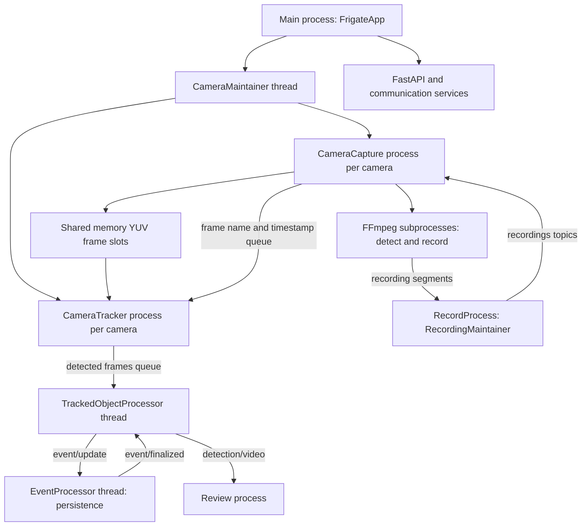

# Runtime architecture

This map describes the Python runtime, not the browser layout. Start with
[`FrigateApp`](../frigate/app.py), which initializes configuration and database
migrations before starting recording, review, embeddings and camera workers.

## Ownership and frame lifetime

[`CameraMaintainer`](../frigate/camera/maintainer.py) manages the capture and
tracker processes for enabled cameras. It owns shared frame-slot allocation
and cleanup, including camera removal and resolution changes. The capture
process runs the watchdog and capture-runner threads. FFmpeg produces raw YUV
frames for detection and separate encoded recording segments.

The capture runner writes a named shared-memory slot such as
`<camera>_frame<i>` and queues its name and timestamp. The tracker reads that
slot, performs motion/object detection and tracking, and queues
`(camera, frame_name, frame_time, detections, motion_boxes, regions)` for the
main process. Full images are not serialized into those queues. When the
output queue is full, the tracker drops that batch and closes its local frame
handle; closing a handle is distinct from unlinking the shared slot.

[`TrackedObjectProcessor`](../frigate/track/object_processing.py) owns `CameraState`
and `TrackedObject` state in the main process. It applies false-positive,
zone and snapshot decisions and publishes event updates. The event processor
persists lifecycle changes and sends a finalized acknowledgment. Only then
can `CameraState.finished` release the corresponding tracked-object state.
Changing this order can leak retained frames or end an event too early.

Recording has a separate media path. `RecordProcess` hosts
`RecordingMaintainer`, which validates/moves FFmpeg segments according to
retention rules. Review grouping runs in another process. Database writes are
distributed across components/processes; there is no single global writer
thread that serializes every database operation.

## Internal messages

See [`comms`](../frigate/comms/) for publishers, subscribers and payload shapes.
ZMQ pub/sub uses topic-prefixed JSON messages through the proxy endpoints
`/tmp/cache/proxy_pub` and `/tmp/cache/proxy_sub`. Subscriber matching is by
prefix. Request/reply communication uses `/tmp/cache/comms` separately.

| Channel or topic | Purpose |
|---|---|
| Per-camera frame queue | Shared frame name and capture time, capture to tracker |
| Detected-frames queue | Frame reference and detection/tracking results, tracker to object processor |
| `detection/video`, `detection/audio`, `detection/api`, `detection/lpr` | Detection results consumed by review and other workers |
| `event/update` | Tracked event lifecycle updates for persistence |
| `event/finalized` | Acknowledgment allowing retained event state to be released |
| `recordings/latest`, `recordings/valid`, `recordings/invalid`, `recordings/saved` | Segment progress, validation and persistence notifications |
| `review/*` | Review-segment lifecycle messages |
| `event_metadata/*` | Event metadata updates |
| `config/cameras/<camera>/<update_type>` | Camera configuration change notifications |

Internal ZMQ topics are not automatically MQTT or WebSocket topics. Outbound
WebSocket messages pass through the per-recipient classifier in
[`ws.py`](../frigate/comms/ws.py). It distinguishes global, camera-scoped and
filtered payloads and enforces each recipient's camera access. Unknown topics
are dropped for **every** client, including administrators. A new outbound
topic therefore needs a classifier rule and authorization tests.

## Where to make changes

- Capture/restarts: [`video/ffmpeg.py`](../frigate/video/ffmpeg.py). Preserve
  enabled-state transitions, restart backoff and recording grace periods.
- Tracking: [`video/detect.py`](../frigate/video/detect.py) and
  [`track/object_processing.py`](../frigate/track/object_processing.py). Account for full
  queues, frame-handle lifetime and event finalization.
- Recording/review: [`record/`](../frigate/record/) and
  [`review/`](../frigate/review/). Keep detection-frame and recording-segment
  ownership separate and consider retention and database consistency.
- APIs: [`api/`](../frigate/api/). Enforce camera access, declare response
  contracts and regenerate the API schema/client after contract changes.
- Messages: [`comms/`](../frigate/comms/). Update producers, consumers and the
  WebSocket classifier together when a public topic changes.

Use hardware/IPC mocks for bounded unit tests and real queue/database behavior
where feasible. Passing those tests is distinct from validation with actual
cameras and accelerators. See [the deployment runbook](DEPLOYMENT.md) for the
live checks required after an owner deploys a release.
